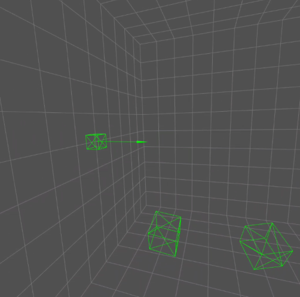
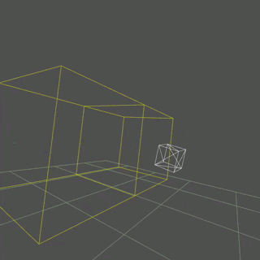

# Threejs-VR-Physics Pages

[https://physicslibrary.github.io/Threejs-VR-Physics/](https://physicslibrary.github.io/Threejs-VR-Physics/)

## System Requirements

Oculus Quest recommended (6DoF headset/controllers). 

Oculus Browser (tested Quest Update >16.0 and three.js r115). 

## 1. Mass on a Spring.

The two green wireframe boxes on the lower right are Touch controllers. For "Mass on a spring",
they do not do anything except to help see hands in VR. The green box on the left is the mass
at x = -0.5m with an arrow showing the force of the spring on the mass as a function of position.

Mass on a spring is solved using Euler method. 

<pre>

F = m * a             (Newton's second law of motion)

a = F/m               (1.1)

F(spring) = -k * x    (Hooke's law for spring) (1.2)

a = -k * x / m        (put 1.2 into 1.1)

dv/dt = -k * x / m    (aceleration = dv/dt, change in velocity with time) (1.3)

v = dx/dt             (velocity = dx/dt, change in distance with time) (1.4)

Equations 1.3 and 1.4 are usually solved using calculus. Since a web browser can multiply and add
floating points very fast, make 1.3 and 1.4 finite-difference equations:

(vnew - vold)/dt = -k * xold / m       (1.3)

vnew = vold + (-k * xold / m) * dt     (1.5)

vnew = (xnew - xold) / dt              (1.4)

xnew = xold + vnew * dt                (1,6)

Put 1.5 and 1.6 into javascript with initial conditions:

var k = 0.2;    // spring constant
var m = 2;      // mass

var xnew, xold, vnew, vold;
xold = 0.5;
vold = 0;
var dt = 0.05;  // time step

</pre>

With an Oculus Quest, open Oculus Browser to link (and "Enter VR"): 

[https://physicslibrary.github.io/Threejs-VR-Physics/examples/threejs_vr_mass_on_a_spring.html](https://physicslibrary.github.io/Threejs-VR-Physics/examples/threejs_vr_mass_on_a_spring.html)

To exit simulation, press left Touch controller menu button.

Code webxr_vr_mass_on_a_spring.html uses a subset of three.js r115 (three.module.js, VRButton.js, and BoxLineGeometry.js). Complete three.js is available from threejs website.

All codes in Threejs-VR-Physics are developed on a Raspberry Pi 3 Model B+ and tested on Oculus Quest. There is a short tutorial on writing three.js codes on a Raspberry Pi in "Making Threejs-WebXR-67P":

[https://github.com/Physicslibrary/Threejs-WebXR-67P](https://github.com/Physicslibrary/Threejs-WebXR-67P)

## 2. Maxwell Equations.

Green lines are electric field Ex, blue lines are magnetic fields By and Bz, red square is positive charge, and green square is negative charge. The yellow box is two visible Yee cells (total 16x16x16 or 4096 cells).

James Clerk Maxwell unified electricity and magnetism in the 19th century.

<pre>

Time-dependent Maxwell equations can be written as:

dE/dt = c^2 curl B - 1/e j              (2.1)     Ampere's Law

dB/dt = -curl E                         (2.2)     Faraday's Law

where E = electric field
      B = magnetic field
      j = current density
      e = permittivity of space
      c = speed of light

The continuity equation is:

d(rho)/dt = - div j                     (2.3)

where rho = charge density

</pre>

150 years later, the equations can be interactively computed in a web browser.

Vector fields E, B, j, and scalar rho are approximated to finite-difference time-domain
variables in javascript. For example, electric vector field E has three components Ex, Ey, and Ez.
Component Ex is indexed (i,j,k) to define its discrete positions in cartesian space.

<pre>

// Compute new E field

  for (i = 0; i < N-1; i++) {
  for (j = 0; j < N-1; j++) {
  for (k = 0; k < N-1; k++) {

  curl_B = By[i][j][k] - By[i][j][k+1] + Bz[i][j+1][k] - Bz[i][j][k];
  Ex[i][j][k] = Ex[i][j][k] + dt * (c1 * c1 * curl_B - c2 * jx[i][j][k]);     // ~ Ampere's Law

  curl_B = -Bx[i][j][k] + Bx[i][j][k+1] + Bz[i][j][k] - Bz[i+1][j][k];
  Ey[i][j][k] = Ey[i][j][k] + dt * (c1 * c1 * curl_B - c2 * jy[i][j]\[k]);

  curl_B = Bx[i][j][k] - Bx[i][j+1][k] - By[i][j][k] + By[i+1][j][k];
  Ez[i][j][k] = Ez[i][j][k] + dt * (c1 * c1 * curl_B - c2 * jz[i][j][k]);

  }
  }
  }

// Compute new B field

for (i = 1; i < N; i++) {
for (j = 1; j < N; j++) {
for (k = 1; k < N; k++) {

curl_E = Ey[i][j][k-1] - Ey[i][j][k] + Ez[i][j][k] - Ez[i][j-1][k];
Bx[i][j][k] = Bx[i][j][k] - curl_E * dt;                                      // ~ Faraday's Law

curl_E = Ex[i][j][k] - Ex[i][j][k-1] - Ez[i][j][k] + Ez[i-1][j][k];
By[i][j][k] = By[i][j][k] - curl_E * dt;

curl_E = -Ex[i][j][k] + Ex[i][j-1][k] + Ey[i][j][k] - Ey[i-1][j][k];
Bz[i][j][k] = Bz[i][j][k] - curl_E * dt;

}
}
}

</pre>

With an Oculus Quest, open Oculus Browser to link (and "Enter VR"): 

[https://physicslibrary.github.io/Threejs-VR-Physics/examples/threejs_vr_maxwell_equations.html](https://physicslibrary.github.io/Threejs-VR-Physics/examples/threejs_vr_maxwell_equations.html)

In animated gif above, right controller in a box (or Yee cell) adds positive charges. The charges in the box next to it become more negatively charged (charge conservation). Add positive charges to that box to reverse polarity. Move charges back and forth to make an oscillating dipole antenna.

Right controller above Yee cells is jx = 0 to stop separating charges.

Right controller near floor (0.2m) resets simulation.

To exit simulation, press left Touch controller menu button.

There is no absorbing boundary for this first simulation. When changing E and B fields reach the boundary of the
finite 16x16x16 computational space, they will reflect (energy conservation). Code resets E, B, j, and rho to zero after computing the four fields 2000 times. This is a balance between the refresh rate of Oculus Quest and the amount of floating points the browser computes between frames.

## References

Pieter B. Visscher, Fields and Electrodynamics, John Wiley & Sons (1988).

P.B. Visscher, "Discrete formulation of Maxwell equations", Computers In Physics. 3 (2), 42 (1989).

Harvey Gould and Jan Tobochnik, An Introduction to Computer Simulation Methods, Addison-Wesley (1996).

[https://threejs.org/](https://threejs.org/)

 Copyright (c) 2020 Hartwell Fong
